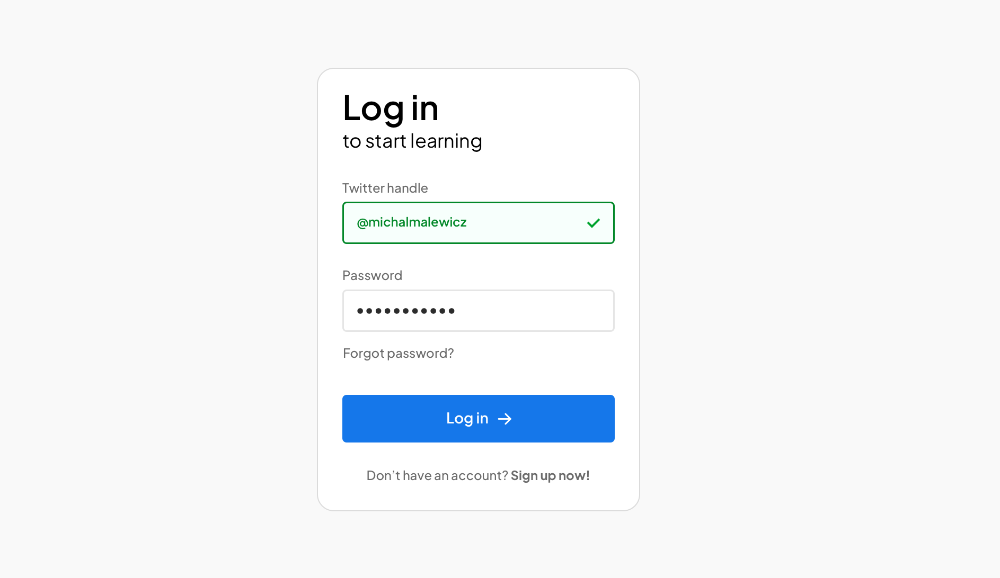

# React Login Card

A simple and modern **login card UI** built with **React** and **Tailwind CSS**.  
The project demonstrates a responsive login form with hover and click effects on buttons, and visually styled input fields.

---

## Table of Contents

- [React Login Card](#react-login-card)
  - [Table of Contents](#table-of-contents)
  - [Demo](#demo)
  - [Features](#features)
  - [Installation](#installation)
    - [Usage](#usage)

---

## Demo

  
_Add a screenshot or GIF of your login card here._

---

## Features

- Modern, responsive login form
- Button with hover lift and click press effect
- Input fields with persistent outlines
- Smooth transitions using Tailwind CSS
- Easy to customize and extend

---

## Installation

1. Clone the repository:

```bash
git clone https://github.com/your-username/react-login-card.git
```

2. Navigate into the project:
   `cd react-login-card`
3. Install dependencies:
   `npm install`

### Usage

- Start the development server:
- `npm run dev`
